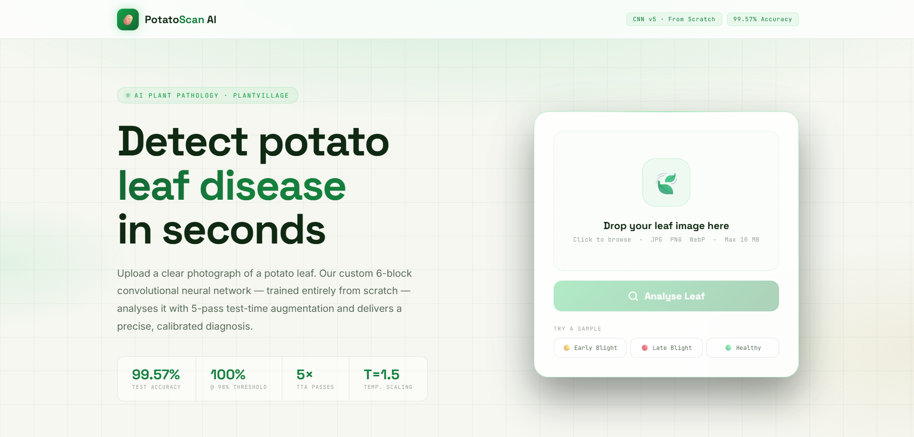
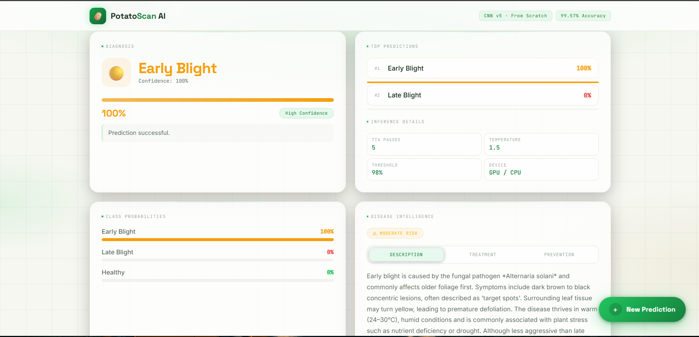
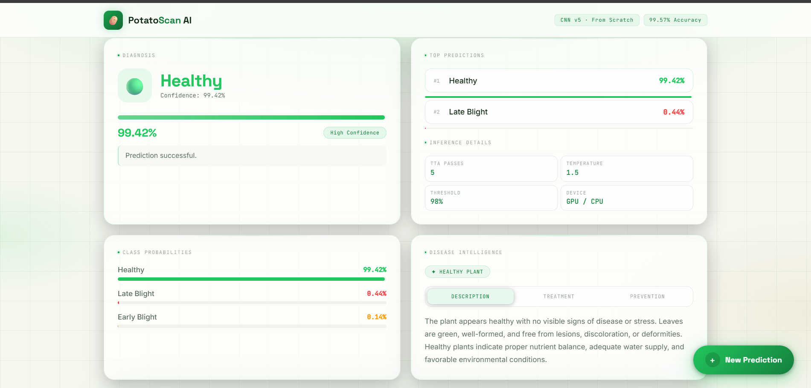

# 🥔 PotatoScan AI

<div align="center">


An AI-powered potato leaf disease detection system built with a custom Convolutional Neural Network and a modern web interface.

🌐 Live Demo: https://itzmoulik-potato-leaf-prediction-model.hf.space/

</div>

---

## 📌 Overview

PotatoScan AI is a deep learning project that identifies potato leaf diseases from uploaded images. It can classify healthy leaves and common diseases such as Early Blight and Late Blight, while also providing confidence scores, disease details, and recommendations.

### Supported Classes
- 🍂 Early Blight
- 🌧️ Late Blight
- 🌿 Healthy

---

## ✨ Features

- Custom CNN trained from scratch
- Image-based disease classification
- Confidence score for predictions
- Disease severity insights
- Treatment and prevention guidance
- FastAPI backend with a responsive frontend
- AI-powered advisory chatbot support

---

## 🧠 Model Performance

| Metric | Value |
|---|---:|
| Validation Accuracy | 99.89% |
| Test Accuracy | 99.57% |
| Mean Prediction Confidence | 99.19% |
| Classes | 3 |
| Parameters | 10.6M+ |

---

## 📂 Dataset

The model was trained on a merged dataset from:
- PlantVillage
- PlantDoc

Total images: approximately 9,280

---

## 🛠️ Tech Stack

- Python
- PyTorch
- TorchVision
- FastAPI
- Uvicorn
- HTML/CSS/JavaScript
- NumPy
- Pillow
- Pandas

---

## ▶️ Run Locally

1. Clone the repository
2. Install dependencies:
   ```bash
   pip install -r requirements.txt
   ```
3. Start the app:
   ```bash
   uvicorn main_v5:app --reload --port 8000
   ```
4. Open:
   ```text
   http://127.0.0.1:8000/static/index.html
   ```

> For the chatbot feature, set the environment variable `OPENROUTER_API_KEY`.

---

## 📁 Project Structure

```text
PotatoScan-AI-main/
├── main_v5.py
├── requirements.txt
├── models_scratch/
├── dataset/
├── static/
└── screenshots/
```

---

## 📸 Screenshots







---

## 🔗 GitHub Repository

Repository: https://github.com/241212017-ui/PotatoScan_AI

---

## 👨‍💻 Authors

- Moulik Dotasara — https://github.com/moulik3637
- Razzak — https://github.com/241212017-ui

---

⭐ If you found this project useful, consider giving it a star on GitHub.
